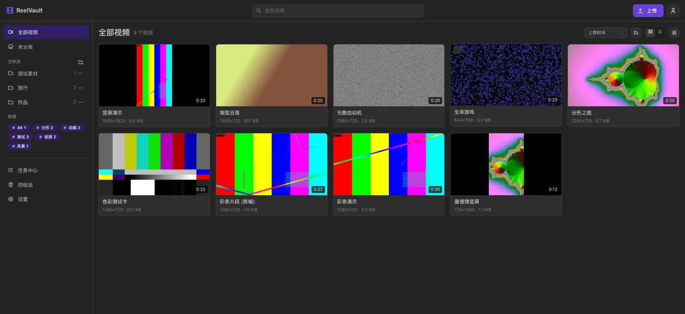
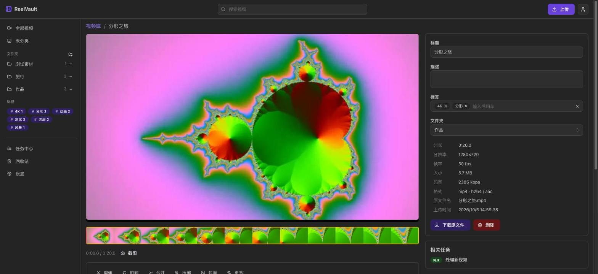
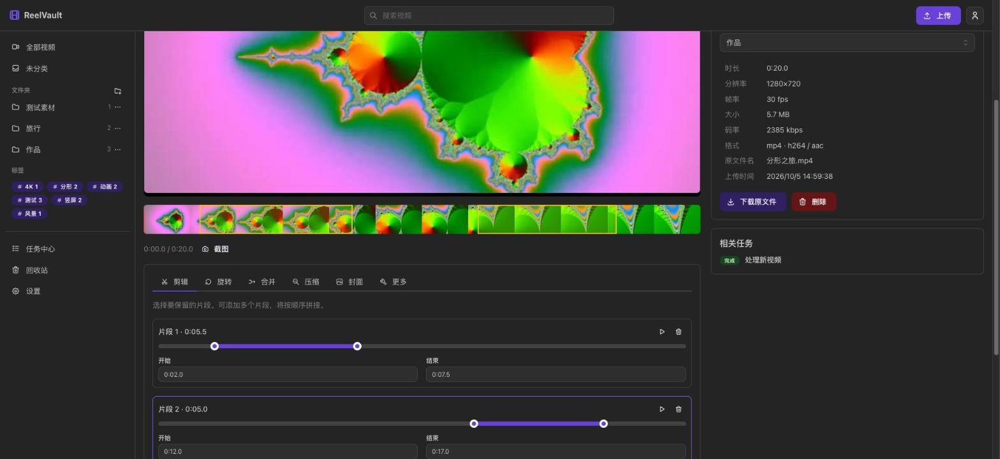
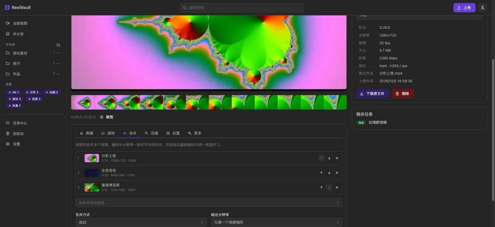
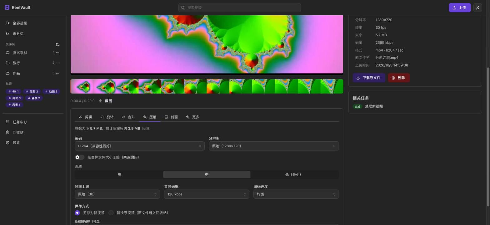
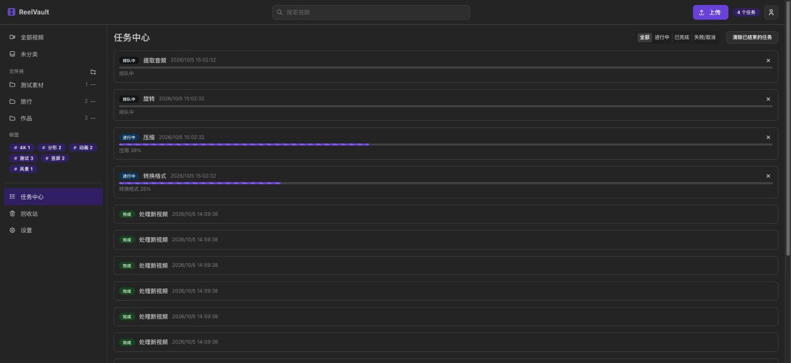
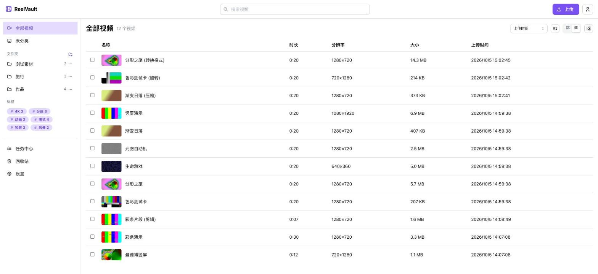
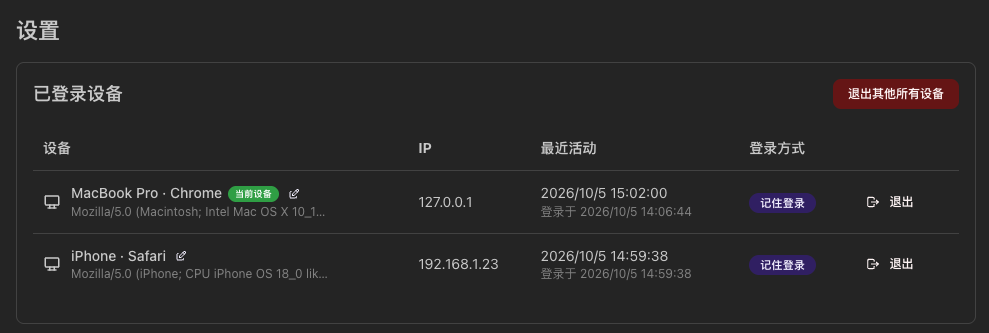
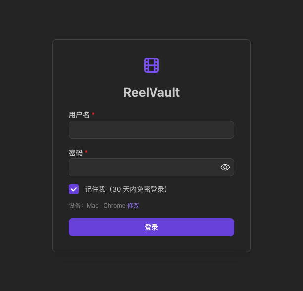

# ReelVault

自托管的视频库：在线播放、后台编辑、视频文件管理。基于 FastAPI + ffmpeg + React，单进程单端口，可直接部署在 Ubuntu，也可用 Docker 运行。

[](https://github.com/Jelatine/ReelVault/actions/workflows/ci.yml)



## 界面预览

| 播放页：播放器、进度条缩略图、视频信息 | 多片段剪辑：时间轴上高亮保留的片段 |
| --- | --- |
|  |  |
| **合并多个视频：调整顺序、自动统一分辨率** | **压缩：编码、分辨率、画质与预估大小** |
|  |  |
| **任务中心：后台 ffmpeg 任务实时进度** | **浅色主题 + 列表视图** |
|  |  |
| **多设备登录管理** | **登录页：记住我 30 天免密** |
|  |  |

## 功能

**播放**
- 浏览器在线播放，支持 HTTP Range 拖动、倍速、全屏、原生画中画、键盘快捷键
- A-B 区间循环、按账号记忆此浏览器的倍速/音量/静音与自动续播开关，文件夹与合集播放列表
- 进度条悬停缩略图（雪碧图 + WebVTT），均匀抽帧覆盖长视频、稀疏关键帧及不足一秒的短视频
- 视频库卡片悬停自动播放预览片段
- 按用户保存播放位置、播放次数和最近播放时间，支持续播
- MKV / AVI / HEVC 等格式提供兼容播放副本；大于 256 MiB 时按需生成，可清理缓存或改用 HLS（能无损封装时只做封装）

**编辑**（ffmpeg 后台任务，实时进度，可取消）
- 剪辑：保留一个或多个片段并拼接，支持「精确（重编码）」和「快速（无损，按关键帧）」
- 编辑器 `,` / `.` 按实际帧时间戳逐帧定位，显示帧号与毫秒时间码；快速剪辑显示并记录吸附到关键帧的实际切点
- 编辑预设：保存、应用、修改与删除常用参数；视频库多选后可批量应用，每个视频一个任务
- 旋转 90° / 180° / 270°、水平/垂直翻转，播放器内实时预览
- 合并多个视频：格式一致时无损合并，否则自动统一分辨率/帧率/音频后重编码
- 压缩：H.264 / H.265、画质档位、目标分辨率、帧率上限，或按目标文件大小两遍编码；显示预估大小
- 封面：以任意时间点画面作为封面、上传图片作为封面、把封面写入 MP4 文件
- 裁切画面（预设比例）、变速、静音、提取音频（MP3/M4A）、格式转换（MP4/WebM/MKV）、任意时刻截图
- 详情页展示编辑链、源视频与完整参数，可用相同参数另存重新生成；清空任务不影响编辑记录
- 剪辑与合并提交前可按当前片段顺序连续预览，无需渲染；变速支持播放器实时预览
- 结果可另存为新视频，或替换原视频（原文件进入回收站，可恢复）

**文件管理**
- 分片断点续传上传、整个文件夹保留目录结构、粘贴视频；上传前选择目标文件夹与标签
- 手机底部导航、抽屉式编辑；触屏滑动快进/后退、双击暂停/播放、长按临时倍速
- PWA 安装到桌面/主屏幕，离线界面与已查看海报缓存，支持手动清理及退出清理
- 中文/英文界面切换，包含播放器、编辑工具、错误提示与离线页面，保留未保存输入
- 合集可排序与连续播放，一个视频可加入多个合集
- Shift 连选、Ctrl/⌘ 多选、框选、Esc 取消；拖到侧栏文件夹移动
- 多级文件夹、标签、FTS5 全文搜索与结果高亮、排序、网格/列表视图
- 标签管理：重命名、颜色、分组、合并及删除，保留视频文件
- 智能文件夹：按账号保存组合筛选与排序，侧栏打开当前匹配结果
- 拍摄元数据：时间、设备、GPS、自定义字段及人工修订，编辑结果继承
- 重复视频检测：完整文件哈希、跨时间点抽帧相似候选、信息汇集及可恢复处理
- 自动分组：拍摄年/月、设备与竖屏/横屏/4K 的动态虚拟分类
- 高级筛选：时长、分辨率/方向、编码、大小、上传/拍摄日期、格式、标签和所在文件夹（含子文件夹），条件同步到 URL
- 搜索语法：标签、评分与时长条件可组合关键词，并保存为动态智能文件夹
- 拼音搜索：中文标题支持全拼、首字母、分音节与声调输入，保留原始标题
- 搜索建议：提示视频标题、标签与文件夹，按账号保存最近 20 条搜索
- 1～5 星评分与收藏，支持筛选与排序，筛选条件保存在 URL 中
- 批量移动 / 打标签 / 合并 / 删除，回收站
- 回收站默认保留 30 天，启动后及每小时清理过期视频；活跃任务使用的文件暂缓清理
- 手动扫描或自动监听服务器视频目录，稳定后复制入库，持久去重

**账号与登录**
- 单管理员账号；首次访问在浏览器中创建，或用环境变量预置
- 同一账号可在多台设备同时登录，设置页可查看/重命名/注销任一设备
- 「记住我」：30 天免密登录，使用中自动续期，令牌定期轮换（数据库只存哈希）
- 登录失败限流、HttpOnly + SameSite Cookie、CSRF 防护

## 快速开始

### Docker

```bash
docker run -d --name reelvault --restart unless-stopped \
  -p 8080:8080 -v $PWD/data:/data \
  ghcr.io/jelatine/reelvault:latest
```

或使用仓库中的 `docker-compose.yml`：

```bash
docker compose up -d
```

打开 `http://服务器IP:8080`，首次访问创建管理员账号。

### Ubuntu (22.04 / 24.04)

从 [Releases](https://github.com/Jelatine/ReelVault/releases) 下载发布包：

```bash
VERSION=0.2.6
curl -LO https://github.com/Jelatine/ReelVault/releases/download/v$VERSION/reelvault-$VERSION.tar.gz
tar xzf reelvault-$VERSION.tar.gz && cd reelvault-$VERSION
sudo ./deploy/install.sh
```

安装脚本会安装 ffmpeg 与 [uv](https://github.com/astral-sh/uv)，创建 `reelvault` 系统用户，把程序装到 `/opt/reelvault`，数据放在 `/var/lib/reelvault`，并注册 systemd 服务。再次运行同一脚本即可升级（配置与数据保留）。

```bash
sudo systemctl status reelvault
journalctl -u reelvault -f
sudo nano /etc/reelvault/reelvault.env && sudo systemctl restart reelvault
```

### macOS（源码编译运行）

适用于 Apple Silicon 与 Intel Mac。需要 [Homebrew](https://brew.sh)。

**1. 安装依赖**

```bash
brew install ffmpeg-full uv node git
```

`ffmpeg-full` 包含字幕烧录所需的 libass。若 Homebrew 提示尚未链接，可用 `brew link ffmpeg-full`；已链接旧版时先 `brew unlink ffmpeg`。也可设置 `REELVAULT_FFMPEG` / `REELVAULT_FFPROBE` 为其完整路径。

uv 会自动下载项目所需的 Python 3.12，无需单独安装 Python。

**2. 获取源码并编译**

```bash
git clone https://github.com/Jelatine/ReelVault.git
cd ReelVault
make install   # 安装后端 (uv) 与前端 (npm) 依赖
make build     # 构建前端，输出到 backend/reelvault/static
```

**3. 运行**

```bash
cd backend
REELVAULT_DATA_DIR=~/ReelVault uv run reelvault
```

打开 <http://localhost:8080>，首次访问创建管理员账号。同一局域网内的手机、平板可通过 `http://<Mac 的 IP>:8080` 访问（首次运行时 macOS 可能弹出防火墙提示，选择「允许」）。

**4. 后台常驻（可选）**

用 launchd 让 ReelVault 随登录启动、崩溃自动重启：

```bash
./deploy/macos/install-launchd.sh            # 数据目录默认 ~/ReelVault
./deploy/macos/install-launchd.sh ~/Movies/ReelVault   # 或指定数据目录
tail -f ~/ReelVault/reelvault.log            # 查看日志
./deploy/macos/install-launchd.sh --uninstall  # 卸载
```

**升级**：`git pull && make install && make build`，然后重启服务（再次运行 `install-launchd.sh` 即可）。

> 也可以在 Docker Desktop 中直接使用上面的 Docker 方式运行，镜像同时提供 arm64 与 amd64。

公网访问建议放在 HTTPS 反向代理之后，参考 [`deploy/nginx.conf.example`](deploy/nginx.conf.example)，并设置 `REELVAULT_SECURE_COOKIES=true`。

## 版本检查与升级

ReelVault 会定期（默认每 12 小时）检查 [GitHub Releases](https://github.com/Jelatine/ReelVault/releases) 上的最新版本。有新版本时，页面右上角会出现提示，在「设置 → 版本与更新」中可以查看发布说明并升级：

| 部署方式 | 升级方式 |
| --- | --- |
| Ubuntu 安装包（`install.sh`） | **一键升级**：自动下载安装包、校验 SHA256、替换程序、安装依赖、同步 systemd 服务配置，然后自动重启。失败时回滚程序与服务配置；回滚未确认会提示检查。有任务正在运行时不允许升级 |
| Docker | 页面给出 `docker compose pull && docker compose up -d` 等命令 |
| 源码运行（含 macOS） | 页面给出 `git pull && make install && make build` 等步骤 |

一键升级依赖 systemd 的 `Restart=on-failure`（安装脚本已配置）：升级完成后程序以退出码 75 退出，由 systemd 拉起新版本。数据库迁移会在新版本启动时自动执行。

Ubuntu 的新版安装脚本会安装 root 所有的 `reelvault-service-sync.path` 和受限辅助服务，并启用 `REELVAULT_SYSTEMD_SYNC=true`。原有安装需从新版安装包运行一次 `sudo ./deploy/install.sh`，以安装辅助服务；之后的在线升级自动同步发布包中的 `deploy/reelvault.service` 并执行 daemon-reload。标准 systemd 安装会自动检查辅助服务是否可用，缺少时显示安装说明。

辅助程序由 `/usr/bin/python3 -I` 从 `/usr/local/libexec` 启动，仅接受固定 ReelVault 账号、启动命令、配置路径与可写目录，保留主服务的 `NoNewPrivileges` 等保护。程序和依赖安装成功后才提交服务配置，重载/确认失败会恢复原配置；root 保存的事务备份可处理确认响应丢失，其他操作已修改主服务文件时拒绝覆盖并提示检查。环境文件与自定义 `reelvault.service.d/` drop-in 不会被在线升级改写。新的账号、启动路径、额外可写目录或尚未支持的指令需要管理员运行新版安装脚本；辅助程序自身也只由安装脚本更新。主服务文件的自定义修改应放入 drop-in。相关日志可用 `journalctl -u reelvault-service-sync.service` 查看。

同步目前针对标准 `/opt/reelvault` Ubuntu 安装；源码、Docker 和 macOS 升级沿用各自方式。显式设置 `REELVAULT_SYSTEMD_SYNC=false` 可选择只升级程序，此时需自行同步 systemd 配置。

Ubuntu 22.04/24.04 的安装与升级已在 [GitHub 托管虚拟机验证](https://github.com/Jelatine/ReelVault/actions/runs/37580047332)：实际安装与重复安装、在主服务权限限制下在线升级并自动重启、依赖/摘要/配置确认失败回滚，以及环境文件、drop-in、元数据和媒体保留。CI 持续运行两种 Ubuntu 的测试。

不希望服务器访问 GitHub 时，设置 `REELVAULT_UPDATE_CHECK=false` 关闭自动检查；`REELVAULT_ALLOW_SELF_UPDATE=false` 只保留检查、禁用一键升级。

## 配置

所有配置通过环境变量（或 `.env` 文件）设置：

| 变量 | 默认值 | 说明 |
| --- | --- | --- |
| `REELVAULT_DATA_DIR` | `./data`（Docker 为 `/data`） | 数据目录：视频、缩略图、数据库 |
| `REELVAULT_HOST` / `REELVAULT_PORT` | `0.0.0.0` / `8080` | 监听地址 |
| `REELVAULT_ADMIN_USER` / `REELVAULT_ADMIN_PASSWORD` | 空 | 预置管理员账号（仅在尚无账号时生效） |
| `REELVAULT_WORKERS` | `2` | 同时运行的 ffmpeg 任务数 |
| `REELVAULT_TRASH_RETENTION_DAYS` | `30` | 回收站自动彻底删除的保留天数；`0` 禁用，修改后重启生效 |
| `REELVAULT_REMEMBER_DAYS` | `30` | 「记住我」有效天数（滑动续期） |
| `REELVAULT_SESSION_IDLE_HOURS` | `12` | 未勾选「记住我」时的闲置过期时间 |
| `REELVAULT_TOKEN_ROTATE_DAYS` | `7` | 长期令牌轮换周期 |
| `REELVAULT_SECURE_COOKIES` | `false` | HTTPS 部署时设为 `true` |
| `REELVAULT_LOGIN_MAX_FAILURES` / `REELVAULT_LOGIN_LOCK_MINUTES` | `5` / `5` | 登录失败锁定策略 |
| `REELVAULT_IMPORT_DIR` | 空 | 可在设置页扫描导入的视频目录 |
| `REELVAULT_CONFIG_FILE` | 未设置 | 从备份恢复的 JSON 配置文件；环境变量与 `.env` 优先 |
| `REELVAULT_FFMPEG` / `REELVAULT_FFPROBE` | `ffmpeg` / `ffprobe` | ffmpeg 可执行文件路径 |
| `REELVAULT_ENCODER` | `software` | 初始编码器：`software` / `auto` / `videotoolbox` / `qsv` / `vaapi` / `nvenc`；设置页保存的选择优先，重启后保留 |
| `REELVAULT_VAAPI_DEVICE` | `/dev/dri/renderD128` | VAAPI 渲染设备路径 |
| `REELVAULT_AUDIO_UPLOAD_MAX_MB` | `128` | 单个音频素材的上传上限（MiB） |
| `REELVAULT_UPDATE_CHECK` | `true` | 是否定期检查新版本 |
| `REELVAULT_SYSTEMD_SYNC` | 自动检测标准 systemd 安装；Ubuntu 安装脚本设为 `true` | 在线升级同步受限的 systemd 服务配置；首次需安装辅助服务 |
| `REELVAULT_UPDATE_CHECK_INTERVAL_HOURS` | `12` | 检查间隔 |
| `REELVAULT_UPDATE_INCLUDE_PRERELEASES` | `false` | 是否提示预发布版本（如 `-rc`） |
| `REELVAULT_ALLOW_SELF_UPDATE` | `true` | 是否允许在页面中一键升级（仅 Ubuntu 安装包部署） |
| `REELVAULT_GITHUB_TOKEN` | 空 | 可选，提高 GitHub API 调用限额 |
| `REELVAULT_UPDATE_REPO` / `REELVAULT_UPDATE_API_URL` | `Jelatine/ReelVault` / `https://api.github.com` | 版本来源（可指向 fork、镜像或 GitHub Enterprise） |
| `REELVAULT_INSTALL_MODE` | `auto` | 部署方式（`package`/`docker`/`source`），默认自动识别 |

### 硬件编码

在「设置 → 编码加速」选择软件编码、自动选择或指定硬件。启动时通过 `ffmpeg -encoders` 探测已编译的 H.264/H.265 编码器；这不保证设备与驱动可用，界面会展示最近任务的实际结果。自动模式依次尝试 VideoToolbox、QSV、VAAPI、NVENC，全部失败后从头使用软件编码；指定硬件失败时直接回退。H.264 回退到 libx264，H.265 回退到 libx265，任务详情显示实际编码器与回退原因。取消任务不会触发重试。

编辑输出、入库预览和兼容播放副本均使用所选编码器。硬件的质量参数只近似映射软件 CRF，画质与文件大小可能不同；目标大小压缩继续使用软件两遍编码，无损剪辑、封装转换等直接复制原流。编码器选项参考 [FFmpeg 编码器文档](https://ffmpeg.org/ffmpeg-codecs.html)。

容器部署还需要映射对应 GPU 设备并提供驱动；仅选择硬件不能让容器获得 GPU。VAAPI 需要可访问配置的渲染设备，NVENC 需要 NVIDIA 驱动及容器 GPU 支持。本项目已在 macOS 实机验证 VideoToolbox 的 H.264/H.265 输出及软件回退；QSV、VAAPI、NVENC 已有参数与回退测试，尚未在对应硬件上验证。

### 任务控制

「任务中心」支持低、普通、高三档优先级，按优先级及提交时间调度；仅尚未启动的任务可调整，不中断正在执行的任务。涉及相同源视频的任务串行处理，独立视频仍可并行，编辑提交提示已有未结束任务。

排队任务可暂停，继续后重新参与调度。运行中的任务在 macOS/Linux 上暂停当前 ffmpeg/ffprobe 进程，继续时保留进程及进度；暂停仍占用工作槽位并保护源文件，可直接取消。服务重启后，未启动的暂停任务保持暂停，运行中（含暂停）的中断任务标记失败；从备份恢复的未完成任务也标记失败，避免自动重复编辑。

失败任务可重试为新任务，保留原失败记录及优先级。已有未结束的重试时拒绝重复请求；源视频已删除或任务已经保存输出时拒绝重试。历史重放与回收站入库任务保留其读取已删除源视频的规则。编辑重试重新读取源视频，另存或替换行为沿用原参数。

剩余时间根据执行期间的进度速率估算，至少积累 3 秒及 1% 进度后显示，不包含排队等待；暂停/继续、进度回退后重新估算。多阶段处理和硬件回退可能导致估算变化。

### 音频处理

在视频详情的「更多 → 音频」中调整原声音量（-60～+24 dB）、响度标准化及淡入淡出，或上传 MP3/WAV/M4A/FLAC 等素材替换音轨、混入背景音乐。原声与素材可分别调音量，素材可延迟进入并循环；不循环时短音频结束后补静音，视频时长保持不变。没有原音轨的视频也可添加音乐。

画面流复制，音频输出 AAC 立体声 48 kHz；WebM 输入改为 MKV 封装以容纳 AAC。标准化在混音后通过单遍动态 `loudnorm` 应用，默认目标 -16 LUFS、真峰值 -1.5 dBTP，随后应用淡入淡出和峰值限制。淡入淡出会改变最终平均响度，增益过大时限制器可能降低音量；参考 [FFmpeg 音频滤镜文档](https://ffmpeg.org/ffmpeg-filters.html#loudnorm)。素材可单独试听，主播放器仍播放原视频。

素材持久保存在 `assets/`，可用于预设、批处理及编辑历史重放；被任务、历史（包括回收站视频）或预设引用时不能删除。编辑、重放及恢复时校验素材摘要，文件缺失或变化时拒绝使用。备份 ZIP 只保存素材元数据，完整备份必须另外复制 `assets/`。

数据目录结构：

```
data/
├── reelvault.db        # SQLite 数据库
├── library/            # 视频文件
├── derived/<id>/       # 封面、预览片段、缩略图雪碧图、可播放副本
├── exports/            # 提取的音频等导出文件
├── assets/             # 上传的音频等编辑素材
└── tmp/                # 分片上传与任务临时文件
```

### 字幕

在详情页「更多 → 字幕」上传 SRT、ASS 或 VTT（不超过 5 MiB），选择名称与语言后自动添加外挂轨道。播放器字幕按钮可开关字幕，设置菜单可切换语言；浏览器使用转换后的 WebVTT，ASS 的字体、位置和特效仅在烧录输出中保留。UTF-8 为默认编码，也可指定 UTF-16 或 GB18030/GBK。

MKV 内封文本字幕按轨道列出，支持浏览器显示和烧录；图像字幕只能烧录。烧录重新编码画面，输出 MP4，可选择 CRF 并使用编辑预设、批处理和历史重放。外挂字幕时间轴对应当前视频；剪辑或替换视频后需重新核对字幕时间。

FFmpeg 必须包含 `subtitles` / libass（用 `ffmpeg -hide_banner -h filter=subtitles` 检查）。Docker 与 Ubuntu 安装脚本安装 DejaVu 和 Noto CJK 字体；macOS 使用系统字体，缺少 ASS 指定字体时可能采用替代字体。字幕原文件保存在 `assets/` 并校验摘要，WebVTT 缓存可再生成。备份时复制整个 `assets/`；仍挂在视频上或被任务、预设、历史引用的素材不能删除。

### 水印与文字

在详情页「更多 → 水印」选择图片或文字叠加。图片支持静态 PNG/JPEG/WebP（最大 10 MiB、4096×4096），解码并保存为 PNG，保留透明通道。图片宽度按视频宽度百分比设置，保持比例并限制在画面内，不透明度与图片原有 alpha 相乘。

可选择四角、居中或自定义位置；自定义水平/垂直百分比基于剩余可用空间，0%/100% 对应两端。文字支持繁简中文、英文、换行，设置字号、颜色、描边和底框；内置 Noto Sans CJK 字体及其 [SIL OFL 许可证](backend/reelvault/resources/fonts/OFL.txt)，无需系统安装中文字体。浏览器按需加载同一字体，封面预览用于检查位置与比例，最终排版以 FFmpeg 输出为准。

水印永久叠加到输出画面，重新编码为 H.264/MP4，支持编码加速、编辑预设、批处理和历史重放。图片素材在 `assets/` 内保存并校验摘要，被任务、预设或编辑历史引用时不能删除；完整备份请复制 `assets/`。文字通过 UTF-8 文件交给 `drawtext`，百分号、引号与表达式均按原文字面显示。FFmpeg 需包含 `drawtext`、FreeType 和 HarfBuzz（`ffmpeg -hide_banner -h filter=drawtext` 检查），macOS 使用前述 `ffmpeg-full`。

### GIF / WebP 动图导出

在详情页「更多 → 动图」选取开始/结束时间，或把播放器当前位置设为片段端点。可预览原始片段，设置输出宽度（16–1920 像素）、帧率（1–60 fps）、循环播放和文件名称。输出保持显示比例，包括非方形像素的源视频；GIF/WebP 没有声音，生成后到任务中心下载。

GIF 先对整个片段运行 `palettegen` 生成调色板，再通过 `paletteuse` 生成动图，支持颜色数与抖色方式。GIF 帧间隔以百分之一秒记录，部分帧率会产生舍入。WebP 支持有损画质或无损编码，无损模式的 quality 参数调节压缩力度。长片段、高帧率和大尺寸会显著增加时间与文件体积。滤镜说明见 [FFmpeg 调色板文档](https://ffmpeg.org/ffmpeg-filters.html#palettegen)，WebP 参数见 [FFmpeg libwebp 文档](https://ffmpeg.org/ffmpeg-codecs.html#libwebp)。

参数可保存为预设并批量导出，每个源视频生成一个独立任务和下载文件；不替换原视频。批处理片段结束时间超过视频时长时裁到结尾，开始时间超出时长的任务失败。任务记录实际片段范围，支持失败重试；导出文件保存在 `exports/`，清空已完成任务时会删除对应文件。

### 合并转场

合并面板可选择交叉淡化、淡至黑/白、左右擦除或滑动、溶解、圆形展开。启用转场时重新编码，相邻片段按指定时长重叠；输出时长为所有片段总时长减去每处重叠。转场时长须短于每段视频，中间片段至少为转场时长的两倍，避免两处衔接超出同一片段。

画面统一尺寸、显示比例、帧率与时间基准；不同画面比例使用黑边填充，非方形像素按显示比例缩放。音轨统一为 48 kHz 立体声并交叉淡化，短音轨补静音，无音轨片段补静音；全部无音轨时保持无声。保留源音轨相对起始时间的延迟。渲染使用 [FFmpeg xfade](https://ffmpeg.org/ffmpeg-filters.html#xfade) 与 [acrossfade](https://ffmpeg.org/ffmpeg-filters.html#acrossfade)。

原始片段预览按顺序播放，不模拟转场和尺寸变化；实际转场效果在生成结果中查看。任务与编辑链保存转场类型和时长，可用相同参数重新生成。未开启转场时保留原有自动/无损/重新编码合并方式。

### 画面调整

在详情页「更多 → 画面调整」设置亮度（-1–1）、对比度与饱和度（0–3），默认值分别为 0、1、1。可上传 UTF-8 `.cube` 调色文件（最大 20 MiB）：支持单独的 1D 表（2–65536）或 3D 表（2–64），包括 DOMAIN_MIN/MAX 输入范围；不接受组合表。1D 使用三次插值，3D 使用四面体插值。上传时检查数据行数、有限数值和本机 FFmpeg 解码能力。

降噪强度 0–20，0 为关闭，使用 `hqdn3d` 时空降噪。防抖先由 `vidstabdetect` 分析完整视频，再用 `vidstabtransform` 平滑运动；可调整抖动强度、分析精度、平滑窗口和额外放大，默认自动放大以减少黑边。自动放大关闭后可能出现边缘黑区；移动物体、快速摇镜或纹理很少的画面可能降低防抖效果。

依次执行防抖、降噪、基础调色与 LUT，输出重新编码的 H.264/MP4，保留音轨和时长。播放器显示原视频，效果在生成结果中检查。参数支持预设、批处理、历史重放和公共硬件编码适配。LUT 永久保存在 `assets/` 并校验摘要，仍被引用时不能删除；完整备份须复制 `assets/`。

FFmpeg 需包含 `eq`、`lut1d`、`lut3d`、`hqdn3d`、`vidstabdetect` 和 `vidstabtransform`。macOS 使用前述 `ffmpeg-full`；其他自定义 FFmpeg 构建需启用 libvidstab。可用 `ffmpeg -hide_banner -h filter=vidstabdetect` 检查。滤镜参数见 [FFmpeg 文档](https://ffmpeg.org/ffmpeg-filters.html#vidstabtransform)。

### 片段级效果

在详情页「更多 → 片段效果」选择倒放、插入定格或局部慢动作。可输入时间码或用播放器当前位置设点；区间前后的内容保留。倒放同时反转选中区间内的画面和声音。定格在指定位置插入静止画面与等长静音，然后从原位置继续播放；定格时长为 0.04–3600 秒。局部慢动作支持 0.1–小于 1 倍速，声音保留音调，画面重复原帧，不生成运动插值帧。

时间按源帧率对齐，超出视频时长的区间结尾裁至结尾；短于一帧或起点超出视频的请求失败。输出统一为恒定帧率并记录实际区间与时长；定格时长和慢动作输出也按整帧对齐，误差通常不超过一帧。可选择 CRF、另存/替换、保存预设、批处理和编辑链重放；播放器显示原视频，效果在结果中检查。

使用 FFV1/PCM 无损临时文件再合并编码为 H.264/AAC MP4（音轨为 48 kHz 立体声），避免片段间重复有损编码。倒放分块并从后向前衔接，按画面尺寸和音频估算每块约 128 MiB 的原始帧缓存预算；解码、编码和滤镜另需内存。临时文件包含标准化源及分段结果，可能远大于原视频，长片段/高分辨率需充足临时磁盘空间，完成或取消后自动清理。参考 [FFmpeg reverse 文档](https://ffmpeg.org/ffmpeg-filters.html#reverse) 与 [atempo 文档](https://ffmpeg.org/ffmpeg-filters.html#atempo)。

### 画中画与分屏拼接

在详情页「更多 → 拼接」添加已就绪的视频并调整顺序。画中画使用两个输入，第一个为主画面；横排、竖排和网格支持 2–9 个输入，网格可设 1–3 列。当前视频须保留在输入中，结果另存为新视频。封面预览展示布局、大小、位置和透明度，播放器播放原视频；输出生成后可播放检查。

画布宽高须为偶数，默认 1280×720、30 fps，可设置 CRF、留边颜色及完整显示或填满裁切。按显示宽高比适配，支持非方形像素。画中画大小同时按画布宽高缩放（5%–80%），水平/垂直位置 0%–100% 表示剩余空间的两端，可设置不透明度。网格空格及偶数格子分配后的余边使用留边颜色。

输出时长可选第一个、最长或最短输入。每个输入从自身时间轴开头播放，保留音视频相对起始延迟；短画面延续末帧，短音轨补静音，长输入裁到输出结尾。声音可用任一输入音轨、混合全部有声输入或无声；混音按有声输入数平均，输出 AAC 48 kHz 立体声。选择无音轨输入时输出无声。

使用 overlay/xstack 重新编码为 H.264 MP4，接入公共硬件编码适配。任务与编辑链保存全部输入顺序、参数及实际布局，支持失败重试和历史重放。此操作涉及多个输入，不适用于每视频独立批处理与编辑预设。参考 [FFmpeg overlay 文档](https://ffmpeg.org/ffmpeg-filters.html#overlay) 与 [xstack 文档](https://ffmpeg.org/ffmpeg-filters.html#xstack)。

### 书签与章节

详情页「书签与章节」可输入毫秒时间码，或使用当前播放时间，保存标题、备注与标记类型。支持修改时间/标题/备注、删除和列表跳转；每个用户对每个视频最多保存 1000 个书签与手动章节，列表每页 20 个。标题最多 128 字符，备注最多 2000 字符。普通书签可设在结尾，章节必须在结尾之前。

播放器原有进度条上显示紫色圆形书签与青色方形章节，可点击或用 Tab 聚焦后按 Enter 跳转；悬停显示时间、标题和备注。场景检测的自动章节同样显示在进度条与播放器 Chapters 菜单中，手动章节名称优先于相同时间的自动章节；只有手动章节时，从开头到第一个章节之间显示「开头」。只添加普通书签不会生成章节。

书签与手动章节按用户隔离，保存于数据库（迁移 `0014`），数据库备份包含其时间和备注。源文件名称、大小或修改时间变化后旧书签保留在列表中，但不再提供跳转与进度条标记；调整时间并保存可重新用于当前视频。修改海报不会使个人书签失效。移至回收站后保留，恢复后继续使用；永久删除视频时级联删除书签。

### 场景检测与自动章节

在详情页「剪辑」展开「场景检测与自动章节」，设置变化阈值（0.01–1，默认 0.4）和最小间隔（0.05–600 秒，默认 1 秒），点击「检测镜头切换」。使用 FFmpeg `select=gt(scene,阈值)` 分析原视频；阈值越低越敏感，最小间隔过滤密集切点及过短的首尾章节。闪光、运动和渐变可能影响结果，需要人工检查；检测本身不改写视频。

结果显示切点时间与变化分数，并将从 0 到结尾的区间列为自动章节。可点击章节跳转，选择一个章节作为剪辑片段，将切点设为当前片段起点/终点，或按全部章节设置多段剪辑。超过 50 个章节时需逐个选择，以遵守剪辑任务的片段数量限制；列表每页显示 20 个章节。快速剪辑仍按关键帧吸附，精确剪辑使用检测时间点。

检测是后台任务，支持任务中心的暂停、继续、取消及失败重试；同一源视频与编辑任务串行。结果保存在数据库中（迁移 `0013`），清理任务记录不会删除章节，数据库备份包含检测结果。视频资源版本、源文件大小或修改时间变化后旧结果不再使用，需重新检测；排队或检测过程中发生变化时任务拒绝保存结果。只保存最近一次成功分析，取消/失败保留已有结果，超过 10000 个有效切点时要求提高阈值或最小间隔。参考 [FFmpeg select 文档](https://ffmpeg.org/ffmpeg-filters.html#select_002c-aselect)。

## 开发

需要 Python 3.12（由 uv 自动管理）、Node.js 22+、ffmpeg。macOS 下用 `brew install ffmpeg-full uv node` 安装；FFmpeg 须包含 libass/subtitles 滤镜。

```bash
make install   # 安装前后端依赖
make dev       # 后端 :8080 + Vite 开发服务器 :5173（代理 /api，前端热更新）
make test      # pytest + vitest
make lint      # ruff、mypy、oxlint、tsc
make build     # 构建前端并拷贝到 backend/reelvault/static
make package   # 生成 Ubuntu 发布包 dist/reelvault-<version>.tar.gz
make docker    # 构建 Docker 镜像
```

项目结构：

```
backend/reelvault/
├── api/            # REST 接口：auth、videos、folders、jobs、system
├── media/          # ffprobe 解析、派生资源生成、编辑操作的 ffmpeg 命令
├── jobs/           # 后台任务队列与处理器（进度通过 SSE 推送）
├── migrations/     # Alembic 数据库迁移（启动时自动执行）
└── auth.py         # 密码哈希、多设备会话、记住我、令牌轮换
frontend/src/
├── pages/          # 视频库、播放/编辑、任务中心、回收站、设置
├── editor/         # 剪辑、旋转、合并、压缩、封面等编辑面板
└── lib/            # API 客户端、分片上传、任务事件
```

### API 错误契约

API 错误保留原有 HTTP 状态与 `detail`，另外返回稳定的 `code` 和 `params`：例如视频不存在返回 `{"detail":"视频不存在","code":"video_not_found","params":{}}`。动态数量、限制及上传恢复位置使用参数返回，上传偏移冲突的旧 `detail.received` 同时保留。表单校验返回 `validation_error`，参数中包含字段位置与 Pydantic 校验类型；框架 404/405、CSRF 与意外服务器错误也提供错误码。客户端可按错误码本地化，不需要解析服务端中文文案；既有诊断详情仍可用于排查。前端错误目录位于 `frontend/src/locales/api-errors.json`。

## 发布

更新 `backend/reelvault/__init__.py` 与 `backend/pyproject.toml` 中的版本号，然后推送 tag：

```bash
git tag v0.2.6 && git push origin v0.2.6
```

GitHub Actions 会构建 `linux/amd64`、`linux/arm64` 镜像并推送到 `ghcr.io/jelatine/reelvault`，同时创建 Release 并附带 Ubuntu 安装包与 SHA256 校验文件。

## 路线图

后续计划（编辑能力、交互、评分/合集/全文搜索等）见 [TODO.md](TODO.md)。


## License

MIT

浏览器端到端测试：先安装后端依赖（`cd backend && uv sync --frozen --extra link-import`），在 `frontend/` 执行 `npm ci`、`npx playwright install chromium`、`npm run build`、`npm run test:e2e`。需要本机 ffmpeg；测试自动启动端口 18089 的临时后端并使用独立数据库，退出后清理。配置遵循 [Playwright webServer](https://playwright.dev/docs/test-webserver)，CI 安装方式见 [Playwright CI](https://playwright.dev/docs/ci)。按需 HEVC 专项运行 `REELVAULT_PLAYABLE_EAGER_MAX_MB=0 npm run test:e2e -- playback-cache.spec.ts`；CI 额外执行此专项，使用小型真实 HEVC 代替上传巨大文件。失败报告位于 `frontend/playwright-report/`，截图与 trace 位于 `frontend/test-results/`。


备份与恢复：设置页的「导出数据库与配置」生成 ZIP，包含 SQLite 一致性快照、当前配置和 SHA256 校验清单，支持数据库使用 WAL 时在线导出。实现采用 [SQLite backup API](https://docs.python.org/3/library/sqlite3.html#sqlite3.Connection.backup)。包内包含密码哈希、设备会话记录和配置凭据，请保存在受保护的位置；服务端备份文件权限为 0600。

完整备份时停止服务，另外复制数据目录的 `library/`、`derived/`、`exports/`、`assets/`，然后在后端 Python 环境中导出：

```sh
python -m reelvault.backup export --data-dir /path/data --output /path/reelvault-backup.zip
```

恢复时停止目标服务，先将上述媒体目录复制到目标数据目录（保持文件名和内部路径），再执行：

```sh
python -m reelvault.backup restore --archive /path/reelvault-backup.zip --data-dir /path/data
# 若目标已有数据库，确认替换后追加 --replace
REELVAULT_CONFIG_FILE=/path/data/restored-config.json python -m reelvault
```

恢复会校验 ZIP 内容、摘要、数据库完整性、迁移版本和媒体路径；缺少原视频或播放副本时拒绝应用。支持导入当前程序认识的旧数据库并迁移到当前版本，来自更新程序的未知版本会被拒绝。恢复会清除设备登录会话和未完成上传，将未完成任务标为失败；账号、整理信息与播放记录保留。`restored-config.json` 的库路径改为目标目录，前端目录重新探测；其余配置可通过环境变量或 `.env` 覆盖。Ubuntu 的 `/etc/reelvault/reelvault.env` 中可设置 `REELVAULT_CONFIG_FILE=/var/lib/reelvault/restored-config.json`，Docker 则将该变量设为容器内路径。

一键升级在替换程序前自动备份，启动时若数据库需要迁移也会先备份；恢复替换现有库前会保存安全备份，应用失败会回滚。自动备份位于数据目录的 `backups/`，不会自动删除，请定期复制到其他磁盘并按需清理。恢复命令和运行中的服务使用互斥库锁，恢复前必须停止服务。


编辑链从迁移 `0007` 起记录生成参数与源文件版本，合并保留全部输入顺序。替换原视频时，编辑前版本进入回收站并保留上游关系；重新生成可读取仍在回收站中的源文件，不恢复它的库可见性，结果始终另存。源版本已删除或不存在时会说明原因并禁用重新生成。封面写入会保留编辑前视频及使用的封面，封面变化后拒绝按原记录重放。旧版保留下来的成功任务可回填源 ID 与参数，但没有可靠源版本的旧记录只供查看；已清理的旧任务无法补回历史。


### 首页仪表盘

登录后首页集中显示继续观看、最近添加、最近编辑、收藏和存储概览，每组最多显示最近 8 项。继续观看按当前账号的最近播放时间排序，跳过未就绪、回收站、刚开始或接近结尾的视频；点击卡片会恢复保存的位置并尝试播放，浏览器拒绝自动播放时仍可点击播放器的继续按钮。首页每 30 秒刷新，也可手动刷新；收藏、评分和任务完成会更新首页。

最近编辑按独立的编辑时间排序，改名、评分或整理不会改变编辑时间；替换原视频会保存新时间，编辑前备份保留旧时间。旧库迁移优先使用保留的成功编辑任务时间，无法恢复精确时间时使用原更新时间/添加时间回填。

存储概览分别显示视频原文件、回收站原文件、HLS 缓存和所在磁盘剩余空间；磁盘使用率还包含缩略图、播放副本、临时文件、备份及其他应用，不将这些重复计入原文件分类。左侧「全部视频」和「打开视频库」进入 `/library`；旧 `/?folder=…`、`/?q=…` 等筛选链接自动跳转并保留参数。

### 播放增强

在视频库网格卡片或列表行上右键，可播放、重命名、移动、修改标签、评分、下载原文件或移到回收站；菜单操作针对右键点击的视频。文件夹右键可新建子目录、重命名和删除，删除文件夹仍会将其中视频与子目录移到上一级。也可先 Tab 聚焦卡片、列表行或文件夹，再按 Shift+F10 或菜单键打开菜单；方向键选择菜单项，Esc 关闭并返回原焦点。移动、标签和评分保存失败时保留输入，便于重试。

按 `/` 聚焦并选中搜索框内容，`U` 选择视频上传，`?` 打开快捷键说明（账号菜单中也有入口）。视频库内方向键移动卡片/列表行焦点，上下按实际网格列定位，左右按显示顺序；`Enter` 打开聚焦视频。`Delete` 删除选中视频，没有选择时删除聚焦视频；确认后移到回收站，取消或失败保留选择。输入框、可编辑区域、中文组合输入、菜单及对话框内不触发全局快捷键；浏览器 Ctrl/⌘/Alt 组合和播放器自己的方向键保留。`Esc` 在视频库取消选择，在菜单或对话框中仅关闭当前界面。

### 进度条缩略图

进度条缩略图按视频时长均匀抽取最多 100 帧，并复制末帧补齐最后一个取样区间。长视频不再跳过非关键帧，避免长 GOP 中的画面变化丢失；相应地需要完整解码，生成时的 CPU 用量可能增加，仍由现有后台任务队列控制。已经缺少缩略图的旧视频可在详情页选择「重新处理」生成资源。

### 标签管理

从侧栏「标签管理」进入独立管理页，可新建标签、重命名、设置十六进制颜色和分组，按名称或分组筛选，并查看视频与回收站的关联数量。未使用的标签也会显示，侧栏视频筛选只显示有活动视频的标签。

合并时选择目标标签并确认，所有视频与回收站关联替换为目标标签，重复关联只保留一次；目标的名称、颜色和分组保持不变。删除标签移除关联，删除分组将其中标签变为未分组，这些操作均保留视频文件。重命名、合并和删除同步更新未完成上传，续传完成后不会重新创建旧标签；全文搜索同步更新。

### 拍摄元数据

视频详情中的「拍摄元数据」显示拍摄时间、设备品牌/型号、GPS 经纬度及可用海拔，也可添加自定义字段。通过 FFprobe 读取 `creation_time`、QuickTime `creationdate`、make/model 与十进制 ISO 6709 坐标；优先采用 QuickTime 拍摄日期并按其时区转为 UTC；缺少时区时按 UTC 解析。未提供或无法解析的字段显示未知，旧库升级会回填有效日期。常见 QuickTime 标签命名参考 [ExifTool 标签说明](https://exiftool.org/TagNames/QuickTime.html)。

「编辑元数据」可修订、清空拍摄信息及增删自定义字段；时间输入明确使用 UTC。GPS 需同时提供纬度和经度，海拔可选；最多 50 个自定义字段，名称最长 64 字、内容最长 1000 字，名称不可空白或重复。保存失败保留输入，切换界面语言保留草稿。「恢复媒体元数据」清除人工修订，恢复原始标签中的拍摄信息，并保留自定义字段。

修订仅保存到视频库，不改写原文件标签；原文件下载保持原内容。人工清空也会保留，重新分析不会恢复已清除的值。另存、替换及替换前保留的版本继承拍摄信息和自定义字段，元数据备份与离线恢复也包含这些信息。新浏览器默认按拍摄时间排序，缺失拍摄时间时使用上传时间；已保存的排序偏好继续生效，关键词搜索默认按相关度排序。

### 自动分组

侧栏「自动分组」按拍摄年份、月份、设备和画面方向/分辨率展示虚拟分类，点击分类进入视频库，可继续叠加搜索、标签、评分等筛选并保存为智能文件夹。分类及打开的结果每五秒刷新，只统计当前就绪且不在回收站中的视频，不改变物理文件夹或创建固定视频成员列表。

拍摄日期统一按 UTC 年/月分类，缺少日期的素材归入「未知拍摄日期」，不使用上传时间代替。设备使用详情中当前有效的品牌/型号，包含人工修订和显式清空；无设备信息时归入「未知设备」，设备分类链接以稳定标识保存，长名称不会进入 URL。修改拍摄信息、生成编辑结果、删除或恢复视频后，分类自动变化；已保存的旧分类没有匹配成员时仍保持空结果，不会扩大为全部视频。

画面分类包括竖屏、横屏、方形以及未知尺寸；4K 按短边至少 2160 像素判断，可同时属于方向分类。视频库显示当前分类名称，并可通过「移除自动分组条件」取消这一条件；清除搜索或标签保留当前自动分组。

### 重复视频检测

从侧栏「重复视频检测」打开结果页，点击「扫描重复视频」扫描所有就绪且不在回收站中的视频。完整文件 SHA-256 找出内容相同的文件；在画面时间区间的八个位置抽帧，结合 dHash、平均颜色、时长与画面比例找出重新编码后的相似候选。相似度是画面比较分数，声音、字幕、局部细节与抽样点之外的内容仍需播放核对；相似关系逐对显示，不会通过第三个视频传递合并。

检测在任务系统中运行，可暂停、继续或取消；未变化的文件复用指纹，文件内容、路径、修改时间或版本变化后需要重新扫描。结果可以按完全相同/相似筛选并分页，任务中心可打开结果页。文件不可用或抽帧失败会显示；能读取完整文件但无法抽帧时仍参与完全相同文件检测。清理任务记录保留指纹与结果。

每组建议按分辨率、码率和大小选择保留版本，也可自行选择，勾选要移入回收站的视频。确认后再次读取完整文件校验哈希，并检查文件版本及未完成任务；过期或变化的结果会拒绝处理。「汇集库内信息」合并标签、评分最高值、收藏、自定义字段和合集成员关系；同名自定义字段保留目标值，字段超过 50 个时保留目标已有项并提示，原值仍在回收站中。拍摄信息、书签及播放记录随各自视频保留。关闭汇集时仅移入回收站，保留视频的信息不变。一次最多处理 1000 个，失败保留选择；文件和原记录按现有回收站规则保留，可恢复。

### 搜索语法

搜索框右侧「搜索语法说明」提供中英文说明。输入如 `tag:旅行 rating:>=4 duration:>10m 2024`，查找包含「旅行」标签、评分至少 4、时长超过 10 分钟且全文包含 `2024` 的视频。关键词仍检索标题、描述、原文件名和标签；`2024` 是普通关键词，按拍摄年份分类请使用「自动分组」。条件用空格分隔，所有条件同时满足，可叠加 URL 中的高级筛选、自动分类与所在文件夹。

`tag:` 精确匹配标签，可重复要求同时包含各标签。含空格的标签使用双引号，如 `tag:"家庭 旅行" tag:精选`；双引号内的引号、反斜线可分别写作 `\"`、`\\`。`rating:` 接受 0–5 的整数；`duration:` 接受非负数，单位 `s`/`m`/`h` 表示秒/分钟/小时，省略单位按秒。两者支持 `>`、`>=`、`<`、`<=`、`=`，省略比较符表示相等，例如 `duration:>=1.5m duration:<1h rating:5`。

前缀与时长单位不区分大小写，标签名称保持原文。未知前缀按关键词处理；已知条件缺值、引号未闭合、单位错误或评分越界显示错误，不会忽略限制。结果只高亮普通关键词。组合语法可保存为智能文件夹，标签改名/合并同步更新其中的 `tag:` 条件，删除标签仍保留原限制。

### 搜索建议与最近搜索

搜索框输入时按视频标题、标签和文件夹分组提示，每组最多 6 条；标题也支持拼音与首字母。选择标题打开视频，选择标签或文件夹进入相应筛选；直接按 Enter 提交全文或语法搜索。建议面向当前可用视频库，不受当前筛选限制，回收站和未就绪视频不显示。

输入为空时显示当前账号最近提交的 20 条搜索，重复提交移到最前，输入过程和打开建议不会新增历史。方向键与 Enter 选择、Esc 关闭；选中历史可按 Delete 删除，也可点击搜索框右侧历史按钮管理和清空。记录保存在服务器，刷新及重新登录保留，各账号独立；删除失败保留原记录。建议与历史最多支持 512 个字符，更长查询仍可按 Enter 搜索，但不记录到历史。迁移 `0024` 新增最近搜索表，数据库备份包含记录；回退该迁移会删除历史，媒体与全文索引保留。

### 拼音搜索

中文标题可直接输入全拼或首字母，例如「旅行日落」支持 `lvxingriluo`、`lv xing ri luo`、`lxrl`，也可组合 `lvxing 日落 tag:旅行 rating:>=4`。拼音不区分大小写，声调可有可无；`ü` 可写成 `v`、`ü`、`u:`，例如 `lǚxíng`、`lüxing`、`lu:xing` 均可匹配「旅行」。支持词组读音（如「重庆音乐」的 `chongqingyinyue`/`cqyy`）与字典支持的繁体字；多音字采用词组字典的默认读音，特殊人名可能需要原文搜索。

匹配仍返回中文标题，网格和列表显示「标题拼音匹配」，原文字词匹配在相关度排序中优先。搜索语法、高级筛选、自动分组、分页和智能文件夹均可叠加。拼音字段针对标题生成，描述、标签和原文件名保留原文全文搜索。搜索框右侧说明包含用法。

升级会回填旧标题的全拼与首字母索引；新视频和标题修改在同一数据库事务内同步索引，标签改名/合并、删除恢复与备份恢复保留对应行为。查询读取保存的索引，不逐个重新转换标题。转换使用锁定版本的离线 [pypinyin 字典](https://pypinyin.readthedocs.io/zh-cn/master/usage.html)，无需外部服务，不改变媒体文件。迁移可回退为原有全文字段及触发器。

### 智能文件夹

在视频库设置标签、评分、时长、日期、所在文件夹等条件及排序，点击「保存为智能文件夹」命名，侧栏会出现动态入口。保存项属于当前账号；保存筛选规则，不保存视频列表，也不改变视频所在文件夹。分页位置不保存，打开从第一页开始。重复名称会提示错误并保留输入，可修改后重试。

打开保存条件时每五秒更新匹配结果。可修改条件预览结果，界面提示尚未保存；点击「更新智能文件夹」才覆盖原条件，也可另存为新项。侧栏菜单可重命名或删除，视频文件保留。标签改名及合并同步保存条件；标签或物理文件夹删除后，原条件继续限制结果，不会自动扩大为全部视频。元数据备份包含智能文件夹规则。

### 键盘与无障碍

按 Tab 可聚焦页面顶部的「跳到主要内容」，按 Enter 跳过重复导航。侧栏文件夹使用链接，子文件夹展开和文件夹菜单使用独立按钮；标签、全部视频及未分类筛选支持 Enter/空格操作，当前页面与筛选状态提供给屏幕阅读器。密码显示按钮也可通过 Tab 操作。菜单和对话框由组件库管理焦点，Esc 关闭后返回触发控件。

聚焦视频卡片后，空格切换选择，Enter 打开视频；卡片标题另有可直接访问的链接。缩略图时间轴支持方向键每次一秒、Shift+方向键每次十秒，以及 Home/End 到开始/结束；剪辑起止滑块、片段选择和合并排序按钮可用键盘操作。图标按钮、评分、进度条和滑块提供中英可读名称，滑块报告当前位置；键盘焦点保持可见，系统减少动态效果偏好会关闭卡片与画面变换的过渡动画。

### 移动端与触控

手机窄屏显示首页、视频库、任务和设置的底部导航，预留底部安全区域。触屏播放器左右水平滑动可快进/后退（滑动一个画面宽度约 60 秒），双击画面暂停/播放，播放时按住 0.5 秒临时将当前倍速加倍（最高 4×）。松开、触控取消或切出页面后恢复原倍速，不改变记忆的播放偏好；按钮、滑块、菜单及页面纵向滚动保留原行为。窄屏或主要使用触屏的设备通过「打开视频编辑」进入底部抽屉，「更多」使用下拉工具选择；关闭抽屉或切换视口时保留未保存的表单内容，同一编辑标签内部的内容也可继续操作。

### 安装应用与离线浏览

使用 HTTPS 访问后，浏览器可将 ReelVault 安装为独立应用。设置页「安装与离线浏览」在浏览器提供安装提示时显示「安装应用」；也可使用浏览器的安装菜单。iPhone/iPad Safari 使用分享菜单中的「添加到主屏幕」。普通局域网 HTTP 地址可以在线使用，但不能启用 Service Worker；本机 localhost 是例外，详见 [MDN 安装条件](https://developer.mozilla.org/en-US/docs/Web/Progressive_web_apps/Guides/Making_PWAs_installable)。开发模式不注册缓存，生产构建才启用。

首次启用后自动缓存完整界面资源（包括尚未打开的页面）；联网登录并查看海报后，海报及标题保存到此设备。断网重新打开任意页面会进入「离线浏览」，已有页面显示离线提示；设置页也可主动打开离线海报。最多保留最近 100 张、每张不超过 1 MiB 的海报，封面更新后替换旧缓存。未缓存的海报、视频播放、编辑和同步需要联网，登录状态与视频文件不作离线缓存。

退出登录、切换登录会话或收到服务器未授权响应时清除离线海报，也可在设置页或离线页面手动清除。离线时无法得知另一台设备撤销了会话，重新联网校验后才会清理；浏览器清理站点数据或空间不足时可能回收缓存。新版本会在所有旧页面关闭后启用，避免自动刷新打断上传和未保存编辑。

### 界面语言

在登录/首次设置页面、用户菜单或设置页选择「中文 / English」，无需重新登录或刷新。语言偏好保存在当前浏览器，并同步到同一浏览器的其他标签页；编辑草稿与已填写表单会保留。默认中文，英文覆盖导航、播放控件、编辑面板、快捷键、任务提示、API 错误及离线页面。视频标题、文件夹、标签、备注与素材名称保持原文，日期按界面语言显示。

翻译目录位于 `frontend/src/locales/`，使用 react-i18next。前端 CI 执行 `npm run i18n:check`，检查界面文案遗漏、中英文参数一致性和模块初始化时固定翻译的问题；维护文案时同时更新中英文目录。FFmpeg 等外部工具的原始技术诊断保留原文。

### 浏览器任务通知

在「设置 → 浏览器任务通知」点击「启用任务通知」，并允许浏览器通知权限；默认关闭，不会在加载页面时请求权限。偏好按账号保存在当前浏览器，并同步其他标签页，可发送测试通知。需要支持 Notification API 的浏览器及 HTTPS 或 localhost；权限被拒绝后，可在浏览器站点设置中重新允许。

页面保持打开并联网时，已观察到运行状态、且运行至少一分钟的任务完成或失败会发送系统通知；历史结果、短任务及取消任务不发送。通知随当前界面语言显示，多标签页由 Service Worker 去重。点击成功通知打开结果视频，其他通知打开任务中心；已有目标页面获得焦点，否则新开页面以保留编辑草稿。关闭通知会清理已显示通知，退出或切换登录会话也会清理。页面关闭后不会接收新任务通知，通知的实际展示受浏览器和操作系统设置影响。权限说明参考 [MDN Notifications API](https://developer.mozilla.org/en-US/docs/Web/API/Notifications_API/Using_the_Notifications_API)。

### 上传与目录导入

点击「上传」、拖拽视频或在页面空白处粘贴剪贴板中的视频文件，会先打开上传设置，选择目标文件夹和标签后开始分片上传。输入框和对话框中保留普通粘贴行为。标题栏的文件夹上传按钮可选择整个本地目录，只上传支持的视频，所选目录及子目录会在目标文件夹下保留；同名文件位于不同子目录时分别入库。断点记录按账号、相对路径、文件大小/修改时间、目标文件夹和标签区分，重新选择相同文件与设置可继续上传。目标文件夹被删除后，需取消并重新选择。

服务器配置 `REELVAULT_IMPORT_DIR` 后，设置页「目录导入」可手动扫描或开启自动监听。监听默认关闭，每 5 秒检查新文件，默认等待大小与修改时间持续稳定 10 秒（可设置 2–3600 秒）。建议先写入不支持的临时扩展名，完成后重命名为视频文件；长时间暂停写入可能被判断为稳定。手动扫描立即复制，复制期间发生变化的文件暂缓入库。导入使用独立副本，源文件随后修改不影响库中视频。跳过符号链接和 ReelVault 数据目录；导入目录不能位于数据目录内。导入路径持久去重，重启、清空回收站或源文件覆盖不会自动重复导入，同一内容放到新路径仍视为新文件。开关及稳定等待时间保存在数据库中；页面显示最近扫描时间、当前启动导入数和失败原因。

详情页「播放增强」可输入 A/B 时间码，或把当前位置设为端点。B 须比 A 至少晚 0.1 秒；开启后在播放时回到 A 重复区间，暂停时仍可自由定位。循环优先于自动续播，切换视频或替换源文件后清除区间；循环由浏览器播放事件驱动，定位精度受浏览器影响。播放器控制栏提供原生画中画，在支持该 API 的浏览器中可进入/退出。

播放器设置菜单的倍速、音量/静音以及「自动播放下一项」开关按账号保存在此浏览器，刷新或换视频后恢复，不随账号同步到其他设备；编辑器变速预览不改变常用倍速。清除浏览器存储后恢复默认值；浏览器拒绝写入存储时，仅在当前页面会话内生效。

「同文件夹播放列表」列出当前目录的全部就绪视频（不包括子文件夹或回收站），按添加时间及 ID 顺序播放；未分类视频也能组成列表。合集按人工排序播放。两种列表都支持搜索选项、上一项/下一项和结束后续播，最后一项停止；列表载入失败或当前视频已移出列表时停止续播。关闭续播开关仍可手动切换，浏览器的自动播放策略可能要求先进行一次点击播放。

### 长任务控制与并行执行

v0.2.7 修复慢磁盘或跨磁盘保存大文件时阻塞服务的问题：输出保存现在由独立进程执行，编码进度最多占 96%，随后显示「保存结果」与实际复制进度，完成发布后才标记成功。暂停/继续/取消同时控制编码及保存进程；取消删除未完成的目标临时文件，原视频保留。长诊断信息不会再使输出读取失败后遗留编码进程；包装程序退出但子进程仍持有管道时，也可取消整个进程组。关闭服务时处理进程启动竞态，避免工作线程重新等待新任务而无法退出。

v0.2.8 进一步修复重复提交播放缓存／转写任务、命中现有缓存或拒绝请求时滞留数据库写锁的问题。任务预算接口现在在返回或抛错前释放写锁，避免并行任务的进度保存、暂停和取消请求等待 SQLite 超时；任务提交及失败重试也统一保证事务结束。默认两个任务工作槽可同时执行不同视频的任务，可通过 `REELVAULT_WORKERS` 调整；同一视频任务仍串行，已运行的暂停任务保留工作槽。模型服务的单次推理仍串行，等待模型的分析任务可暂停或取消。

默认可同时运行 **2 个任务**，由 `REELVAULT_WORKERS` 配置，修改环境配置后重启服务生效。「设置」显示当前并发任务数。不同源视频可并行，涉及同一源视频的任务会串行，避免编辑覆盖；真实回归验证一个任务暂停保存时，另一视频仍能完成压缩。运行中的暂停任务仍占一个执行槽位；并发数也受 CPU、内存、硬盘与硬件编码会话数限制，每个 FFmpeg 自身还会使用多个线程。可先保留默认 2，再按服务器负载调整；增加并发数不会保证单任务更快。磁盘无响应或内核不可中断 I/O 时，系统信号的生效仍取决于操作系统，但文件复制不再堵住 HTTP 服务。

### 兼容播放缓存

浏览器不兼容的 MKV / AVI / HEVC 等视频，原文件不超过 256 MiB 时沿用入库时预生成兼容副本；更大的视频只生成封面、预览及缩略图，首次需要播放时在详情页点击「生成兼容播放缓存」。兼容的原文件始终直接播放，不会额外转码。可配置 `REELVAULT_PLAYABLE_EAGER_MAX_MB`（0–102400，默认 256）；设为 `0` 将所有需要兼容副本的视频改为按需生成。已有缓存保留，升级不会自动删除。

按需生成接入任务队列、硬件编码与软件回退，支持暂停、继续、取消和失败重试；重复请求复用同一任务。提交预留主存储空间，完成前再次检查预算，临时文件成功后才发布；失败、取消或源文件变化不会替换原文件或发布半成品。缓存按源文件名、大小与修改时间检查，变化后需要重建。上传尚未探测编码时仍保留保守的空间预估；入库探测后，大文件不再预留整段兼容副本的生成空间。

详情页显示缓存大小并提供「清理兼容播放缓存」。清理只删除该视频派生目录中的副本，原文件下载、预览和缩略图保留；正在生成时拒绝清理。开启下述 HLS 后也可直接生成并使用 HLS，无需另存整段兼容 MP4。HLS 与兼容 MP4 为独立缓存，清理其中一种不会删除另一种。

创建单视频或合集分享前，分享范围内需要兼容副本的视频须先准备好兼容缓存。访客不会触发昂贵的转码；清理已有分享的缓存后，访客页会提示联系分享者，重新生成后恢复播放，允许的原文件下载继续可用。访客页目前使用兼容 MP4，不使用管理员的 HLS 地址。备份保存缓存引用与源签名；恢复时仍需要同时保留或迁移对应媒体文件。重启清理未提交的缓存文件，保留数据库引用的已完成缓存。

### HLS 自适应播放

在「设置 → HLS 自适应码率」开启，默认关闭。打开详情页时，达到自动生成阈值的视频会加入任务队列；默认阈值 256 MiB。也可手动为较小视频生成。根据源分辨率生成不超过原尺寸的 360p/720p/1080p，小于 360p 的视频保留原高度；宽度最多 1920，保持显示比例。采用软件 H.264/AAC 编码、四秒对齐分片；任务支持暂停、继续与取消，不替换原视频。

生成完成且播放器尚未开始时自动使用 HLS；正在播放时可点击「使用自适应播放」，切换原始流与 HLS 时保留位置和播放/暂停状态。自动模式按带宽和播放器大小选择清晰度，也可在播放器「Settings → Quality」中指定档位；原生 HLS 浏览器的控制能力取决于浏览器支持。播放器库随视频页打包，无需访问外部 CDN。生成失败后可手动重试，清理缓存后需手动重新生成。

缓存位于 `derived/<视频 ID>/hls/`，默认总上限 20 GiB；设置页显示占用量，可清理全部或单个视频缓存。生成前及发布缓存前检查磁盘空间与缓存上限，并为排队任务预留估算容量；需要保留至少 64 MiB 余量。活跃任务未结束时拒绝清理，关闭 HLS 会取消生成任务并停止提供 HLS 资源，已有缓存保留。源路径、大小或修改时间变化会使缓存失效；重新生成成功后替换旧缓存，启动时清理未完成的孤立目录。设置保存到数据库，重启后生效。环境变量初始值为 `REELVAULT_HLS_ENABLED=false`、`REELVAULT_HLS_MIN_SIZE_MB=256`、`REELVAULT_HLS_MAX_CACHE_GB=20`。


### 磁盘空间预警与任务预算

设置页可保存剩余空间的 MiB 与百分比阈值，默认 1024 MiB / 5%，取较大值；均设为 0 关闭预警。登录后的各页面每 15 秒刷新预警，显示扣除未完成上传及任务预算后的可用空间。环境变量为 `REELVAULT_STORAGE_WARNING_MB`、`REELVAULT_STORAGE_WARNING_PERCENT`；已保存的页面设置在重启后仍生效。

上传设置显示所有选中文件的合计预估；每个文件申请上传时再次核算预算。编辑提交时先显示空间估算，再由服务器检查实际提交，包括批处理、失败重试和编辑链重新生成。估算考虑时长、码率、分辨率、帧率、目标大小、动图、FFV1 中间文件与播放副本；替换视频保留原文件，因此不会抵扣原文件大小。上传尚未分析编码，按原文件大小的四倍加 32 MiB 预留原文件及派生媒体；上传完成后按探测结果更新派生媒体预算。

预算记录在数据库中，并通过 SQLite 写事务序列化新任务与上传的申请。排队、运行和暂停任务均占用预算；取消或完成后释放，上传已写入的字节不再重复预留。编辑完成后把剩余预算转交派生媒体任务。启动任务与上传续传时重新检查磁盘，预算不足返回 HTTP 507 / `storage_budget_exceeded`，保留编辑参数或已上传片段以便清理后重试。除预算外保留 64 MiB 工作余量，预警阈值本身不限制任务。运行中的任务保留完整估算，因此核算偏保守。估算不是磁盘配额或最终文件大小保证，内容与编码设置、其他程序写入仍会改变实际占用。


### 多存储位置与外接硬盘

设置页「存储位置」可登记最多 32 个附加目录、选择默认位置、修改名称与挂载路径。先在操作系统挂载硬盘，并为服务账号准备可写的空目录，再填写服务器上的绝对路径。新目录创建 `library/` 与 `.reelvault-location.json` 身份标记；已有 ReelVault 存储目录可重新连接。非空的普通目录请使用目录导入。存储目录不能互相重叠或包含主数据目录，主存储始终保留。

上传设置与编辑「另存为新视频」可选择存储位置，目录导入使用默认位置。上传与任务提交后固定目标，修改默认位置不会改动未完成任务。替换与嵌入封面保存到原视频所在位置，替换前的原文件仍在同一硬盘的回收站记录中。上传暂存、编辑工作文件、缩略图、H.264 播放副本、HLS 和下载导出仍位于主数据目录；使用外接硬盘仍需给主存储留出空间。已有视频不会自动迁移。

每次读取和写入附加库时检查身份标记；目录缺失、硬盘未连接或标记不匹配会返回 HTTP 503，不创建替代根目录、不改写视频路径，也不会因断盘自动删除回收站记录。硬盘重新挂载到不同路径时，在设置页更新「挂载目录」，保留原标记与 `library/`。不要复制同一个标记来登记另一块独立硬盘。运行中拔盘仍可能使当前操作失败，应先结束上传与任务后卸载。

空间预估与预警逐存储位置显示；同一文件系统上的目录按设备共用空间和预算，不把可用空间相加。外部编辑输出采用保守估算，主存储同时预留工作文件和派生媒体；目标硬盘不足或未连接会阻止提交。预算与上传目标保存在数据库，重启、继续上传与重试均保留目标。迁移 `0025` 为旧上传默认指定主存储，不改动旧视频路径。回退迁移前请取消未完成上传。

Docker 部署需额外挂载目录，例如将宿主机 `/mnt/archive/reelvault` 绑定到容器 `/archive` 后，在界面填写 `/archive`；容器与宿主机路径不能混用。systemd 服务账号需要目标目录写权限，附加硬盘建议挂载到 `/mnt` 或 `/media`；默认 `ProtectHome=true` 会限制 `/home`、`/root` 下的目录。设置页不会操作系统挂载、权限或 systemd 沙箱配置。

完整备份除主数据目录外，还需另行复制每个附加目录的 `library/` 和 `.reelvault-location.json`。元数据 ZIP 包含位置配置与稳定身份 ID，不包含视频原文件。恢复前连接所有硬盘；挂载路径变化时，可用 `REELVAULT_STORAGE_LOCATIONS` JSON 提供相同 ID 的新绝对路径（每项包含 `name` 与 `path`）。恢复会校验身份和原文件，缺盘时拒绝安装数据库，保留现有库。S3 兼容存储列为独立 P2 后续工作。


### 只读分享链接

视频详情的「分享」和合集页的「分享」可生成访客链接，无需访客注册或管理员登录。有效期默认 168 小时，可设 1–8760 小时；可选访问密码（至少 6 个字符），原文件下载默认关闭。同一账号最多保留 200 个链接，设置页「分享链接」可查看、复制和撤销；撤销只删除链接及访客授权，不删除视频。创建失败保留表单，复制受浏览器限制时可手动选择地址复制。

访客页只提供播放、合集切换和已允许的原文件下载。合集按当前成员顺序连续播放，只展示已就绪且未删除的视频；移除成员或删除视频后，后续访问立即失效，恢复未永久删除的视频可重新出现在仍有效的分享中。视频编辑完成后分享展示当前版本。合集删除会撤销对应链接。公开数据仅包含标题、时长、画面尺寸和分享范围内的媒体地址，不暴露 GPS、原文件路径、编辑来源、个人标签或管理员 API 地址。

链接使用 256 位随机令牌，访问密码使用 Argon2 哈希。密码验证产生仅针对该链接的 HttpOnly 授权 Cookie，最多有效 24 小时并受链接有效期限制；不会产生管理员会话。每个实际连接来源连续错误 5 次锁定 15 分钟，独立于管理员登录限流；反向代理下以代理连接地址计数，不信任任意 `X-Forwarded-For`。限流状态保存在服务内存中，重启后重置。部署请使用 HTTPS 并启用 `REELVAULT_SECURE_COOKIES=true`。

每次播放、封面和下载请求都重新校验链接、有效期、访问密码授权、视频状态与当前合集成员。下载关闭时原文件下载接口返回 403；播放仍会向访客设备发送媒体，无法阻止录屏或保存播放数据。页面每五秒刷新，撤销或过期后停止提供视频；已送达或缓冲的数据无法收回。分享相关页面和 API（含错误）使用 `no-store`、`no-referrer`、`noindex`，PWA 不缓存分享元数据或媒体。链接持有者可访问无密码分享，应仅把链接交给预期访客。

数据库迁移 `0026` 增加分享链接与独立访客授权表。元数据备份保留链接、密码哈希及有效期，恢复时清除访客授权，需要重新输入密码；回退该迁移会删除所有分享链接和授权，视频与合集保留。

### WebDAV 播放器访问

在「设置 → WebDAV 播放器访问」生成独立访问密码，再启用只读访问。在支持 WebDAV 的播放器中填写页面显示的 `/dav/` 地址、用户名 `reelvault` 和生成的密码。密码仅在生成时显示，离开或刷新页面后无法再次查看；可重新生成，旧密码随即失效。关闭开关保留密码，撤销访问会清除密码并关闭 WebDAV。

目录提供全部视频、原有文件夹层级和合集，合集保留成员顺序；仅展示已就绪且未进入回收站的视频。播放和下载使用原文件，支持 HEAD、HTTP Range 和拖动播放，播放器需支持原视频编码。WebDAV 不会自动转码，也不会写入、删除或改名视频。虚拟地址中的视频 ID 保持稳定，修改视频标题后旧地址仍可使用；文件夹移动或合集成员变更会更新浏览范围。外接存储断开时仍可浏览目录，播放返回不可用，不会误读挂载点上的其他磁盘。

采用 [WebDAV PROPFIND](https://www.rfc-editor.org/rfc/rfc4918) 与 [HTTP Basic 认证](https://www.rfc-editor.org/rfc/rfc7617)。目录支持 `Depth: 0` 和 `Depth: 1`；无限递归列出目录会返回 `403 propfind-finite-depth`。管理员登录 Cookie、管理员密码和公开分享授权不能替代播放器密码。该密码允许读取整个视频库，请通过 HTTPS 或可信局域网连接。每次请求重新检查启用状态与当前密码；已开始的文件传输可能持续到下一次请求。

配置和密码哈希在本机数据库持久化，正常重启保留；数据库备份不含明文密码，恢复备份后撤销播放器访问，需要重新生成密码并启用。WebDAV 默认关闭，不需要额外的服务端端口或生产环境播放器依赖。DLNA 自动发现与电视目录协议仍在后续实施范围。

### 验证器两步验证

设置页「两步验证」输入当前密码后，可用验证器 App 扫描二维码或手动输入密钥；输入六位验证码并确认才会启用，未确认的设置在 10 分钟后过期，且只能由开始设置的设备确认。使用标准 [TOTP](https://www.rfc-editor.org/rfc/rfc6238) 和 [otpauth 设置格式](https://github.com/google/google-authenticator/wiki/Key-Uri-Format)，无需第三方服务。启用后新登录需要密码和验证码，也可使用一次性恢复码；启用、关闭会退出其他设备，当前设备保留。

确认启用时显示 10 个恢复码，可下载为文本，请离线安全保存；页面关闭后不再提供明文。每个恢复码只能使用一次，重新生成需要当前密码及验证码或尚未使用的恢复码，并立即替换旧恢复码。修改账号密码和关闭两步验证也需要验证。丢失验证器时可用恢复码登录并关闭或重新设置。服务器与手机应校准时间；接受前后一个 30 秒时间步，已成功使用的验证码不可再次使用，请等待 App 显示新验证码。

验证器密钥在数据库内使用认证加密保存，本地加密密钥为主数据目录的 `.auth-key`（权限 `0600`）；恢复码仅保存哈希。缺失或损坏加密密钥时不会自动替换，验证码登录会关闭，仍可使用有效恢复码恢复访问。密码正确后才验证第二步，失败按实际客户端地址限流；验证码与恢复码消费和登录会话创建在同一事务内完成，防止并发重复使用。

元数据 ZIP 备份包含 `.auth-key` 的内容及加密验证器状态，因此备份应与账号凭据一样妥善保护，需要额外加密时请使用受保护的备份工具。恢复前校验密钥与验证器数据；密钥缺失、损坏或不匹配时拒绝安装数据库。旧版三文件 ZIP 仍可恢复，已启用验证器和剩余恢复码在新备份中保留；未完成设置和旧登录会话在恢复时清除。迁移 `0027` 新增验证器表，回退该迁移会删除两步验证设置。

### 可选的链接导入

链接导入默认关闭。安装下载组件后，在「设置 → 链接导入」启用，并设置视频大小上限与下载运行超时；从用户菜单选择「从链接导入」，填写 URL、可选标题、目标文件夹和存储位置，确认下载权利后提交。请仅下载有权使用的视频，并遵守版权与来源站点条款。

源码部署在 `backend/` 执行 `uv sync --frozen --extra link-import`；标准 Ubuntu 安装在 `/opt/reelvault` 中由服务账号执行 `uv sync --frozen --no-dev --extra link-import`，然后重启服务。也可通过 `REELVAULT_YT_DLP` 指定管理员安装的 yt-dlp 可执行文件。在线升级会保留已安装的可选依赖，回滚到不含该依赖组的旧版本时按旧清单同步。

需要 JavaScript 求解的网站（例如 YouTube）还需将 Deno 2.3+ 安装到服务的 `PATH`；下载器仅启用 Deno，并禁用远程求解组件与第三方插件。PyPI 可选依赖包含匹配的 `yt-dlp-ejs`，无需运行时下载求解代码。详见 [yt-dlp JavaScript 支持](https://github.com/yt-dlp/yt-dlp/wiki/EJS)。站点限制、登录要求或 DRM 可能导致下载失败；此入口不接受浏览器 Cookie、账号密码或自定义下载命令。

默认发布镜像不带下载组件。可从源码构建包含 yt-dlp 与 Deno 的镜像：

```sh
docker build --build-arg REELVAULT_LINK_IMPORT_EXTRA=1 -t reelvault:link-import .
```

一次仅导入一个视频，播放列表取首项，不下载直播。提交时固定目标存储并预留下载及处理空间；下载完成后进入现有入库任务，生成海报和播放资源。任务中心支持暂停、继续、取消与失败重试；暂停时间不计入运行超时。失败保留表单内容，取消或失败清理临时下载文件。关闭功能仅阻止新提交与重试，已提交任务请在任务中心取消。

默认只访问公开 HTTP/HTTPS 地址，拒绝 URL 中的账号密码、本机、内网和保留地址；下载代理对重定向和每次连接重新检查目的地址，并限制流量。确需导入可信内网来源时，部署管理员可设置 `REELVAULT_LINK_IMPORT_ALLOW_PRIVATE=true`；此权限不在网页中开放。大小上限默认 1024 MiB，运行超时默认 30 分钟，可通过设置页持久化，也可在首次启动前设置 `REELVAULT_LINK_IMPORT_ENABLED`、`REELVAULT_LINK_IMPORT_MAX_MB`、`REELVAULT_LINK_IMPORT_TIMEOUT_MINUTES`。

### 审计日志与 Prometheus 指标

「设置 → 审计与指标」按时间查看登录成功、失败和限流、退出、视频移入回收站/恢复/彻底删除、重复整理删除、到期清理及升级结果，支持事件筛选、刷新和分页。记录包含操作人、客户端来源、对象 ID 和时间，不记录密码、验证码、Cookie、下载 URL 或采集令牌。登录失败中的操作人是请求提交的用户名，未经身份验证；客户端来源使用框架解析的请求地址，不自行读取 `X-Forwarded-For`。升级区分开始、程序已应用等待重启、失败和新版本启动；回滚未确认不会显示已恢复。

审计默认保留 90 天、最多 10000 条，每次写入、启动及每小时维护清理过期记录；可通过 `REELVAULT_AUDIT_RETENTION_DAYS`（1–3650）和 `REELVAULT_AUDIT_MAX_EVENTS`（100–1000000）调整。审计与对应的视频记录变更同一事务提交。元数据备份包含审计历史与任务累计指标。

Prometheus 采集默认关闭。部署管理员设置 `REELVAULT_METRICS_TOKEN` 为 32–256 个无空白 ASCII 字符的独立随机令牌，并重启服务；采集端以 `Authorization: Bearer <令牌>` 请求 `/api/system/metrics`。令牌不能通过 URL 查询参数或登录 Cookie 代替，不在设置页、指标或元数据备份中返回；恢复备份后需重新配置。公网采集应使用 HTTPS。

示例 Prometheus 配置，将相同令牌放入采集端的只读凭据文件：

```yaml
scrape_configs:
  - job_name: reelvault
    scheme: https
    metrics_path: /api/system/metrics
    authorization:
      type: Bearer
      credentials_file: /etc/prometheus/secrets/reelvault-token
    static_configs:
      - targets: ['reelvault.example.com:443']
```

指标采用 [Prometheus 文本格式](https://prometheus.io/docs/instrumenting/exposition_formats/)：

| 指标 | 含义 |
| --- | --- |
| `reelvault_jobs{kind,status}` | 当前任务数；`queued` 为队列长度，`paused` 与 `running` 分开 |
| `reelvault_jobs_completed_total{kind,status}` | 本功能安装后累计成功、失败和取消次数 |
| `reelvault_job_duration_seconds{kind,status}` | 从任务开始到结束的墙钟耗时直方图，包含暂停与中断至恢复判定时间；排队取消不产生耗时样本 |
| `reelvault_storage_online{location}` | 位置是否在线；断盘时为 0，并省略该位置的磁盘字节指标 |
| `reelvault_storage_free_bytes` / `reelvault_storage_total_bytes` | 文件系统空闲和总容量 |
| `reelvault_storage_reserved_bytes` / `reelvault_storage_available_bytes` | 未完成上传/任务预算，以及扣除预算后的可用空间 |

磁盘指标带稳定位置 ID；同一文件系统上的目录共享容量和预算，不应相加。任务种类与状态标签限定为固定集合，不使用用户名、视频标题、URL 或每个任务的 ID。累计指标独立持久化，删除任务记录、重启或升级不会减少计数；恢复旧备份可能重新设定累计基线。历史任务不回填，新任务和升级时尚未结束的任务从启用版本起统计。

常用查询：队列长度 `sum(reelvault_jobs{status="queued"})`；15 分钟任务 P95 `histogram_quantile(0.95, sum by (kind, le) (rate(reelvault_job_duration_seconds_bucket[15m])))`；主磁盘可用空间 `reelvault_storage_available_bytes{location="local"}`。

### 本地语音转写与内容搜索

「内容搜索」检索手动添加及 Whisper 转写的字幕。每个结果显示原文和时间范围，点击标题/时间点直接在播放器定位；可限制为某个视频，也可组合 `tag:`、`rating:`、`duration:` 条件。中文一两个字也可搜索，多个关键词必须出现在同一字幕片段，不进行拼音或语义扩展。视频库的关键词结果可切换到字幕内容搜索。回收站和不可用源文件不参与搜索；源文件签名变化后旧转写不再提供过期时间点。

视频详情提供「语音转写与内容搜索」面板，选择自动识别或指定语言后提交后台任务。采用 [faster-whisper](https://github.com/SYSTRAN/faster-whisper) 的 Whisper 模型，在服务器本地以 CPU/int8 推理，音视频不会发送给识别服务。生成外挂 WebVTT 字幕，可在播放器中切换或用已有字幕烧录功能编辑；未识别到语音时返回空字幕及明确提示，不制造片段。重新转写仅在成功后替换上一次生成的轨道，失败/取消保留已有字幕。移除转写清理其轨道与搜索索引，手动添加的字幕保留；字幕素材仍按现有素材管理和编辑历史规则保留。

转写默认关闭，普通安装不包含模型依赖。源码部署在 `backend/` 运行：

```bash
uv sync --frozen --extra transcription
uv run --frozen --extra transcription python -m reelvault.media.transcription_worker \
  --prepare --model base --cache /absolute/path/to/data/models/whisper
```

`--cache` 必须指向实际 `REELVAULT_DATA_DIR` 下的 `models/whisper`。如同时使用链接导入，同步依赖时同时添加 `--extra link-import`。Ubuntu 安装可执行 `sudo env REELVAULT_TRANSCRIPTION_EXTRA=1 ./deploy/install.sh`，或由服务账号在 `/opt/reelvault` 同步该依赖；准备模型也必须以服务账号执行，保证模型可读写。首次准备从 Hugging Face 下载模型，需要服务器联网；完成后普通任务默认只读取本地模型，不联网下载。模型目录属于媒体之外的可重建缓存，元数据备份不包含它，迁移服务器时需复制或重新准备。

随后设置部署环境并重启服务：

```dotenv
REELVAULT_TRANSCRIPTION_ENABLED=true
REELVAULT_TRANSCRIPTION_MODEL=base
REELVAULT_TRANSCRIPTION_THREADS=2
REELVAULT_TRANSCRIPTION_MAX_HOURS=6
REELVAULT_TRANSCRIPTION_DOWNLOAD_MODEL=false
```

模型可选 `tiny`、`base`、`small`、`medium`、`large-v3`，更大模型占用更多内存；切换后先用相同 `--model` 准备相应模型。部署者也可显式设置 `REELVAULT_TRANSCRIPTION_DOWNLOAD_MODEL=true`，允许任务加载模型时下载；加载阶段不伪造百分比，用户仍可暂停或取消。默认单个视频最多六小时，部署可调整到 1–24 小时；任务会预留 16 kHz 单声道 WAV 的磁盘空间，并验证字幕大小、数量与时间范围。

Docker 使用可选镜像构建参数，随后在运行的容器中准备模型：

```bash
docker build --build-arg REELVAULT_TRANSCRIPTION_EXTRA=1 -t reelvault:transcription .
docker run -d --name reelvault -p 8080:8080 -v "$PWD/data:/data" \
  -e REELVAULT_TRANSCRIPTION_ENABLED=true reelvault:transcription
docker exec reelvault python -m reelvault.media.transcription_worker \
  --prepare --model base --cache /data/models/whisper
```

模型加载、识别和音轨提取均在可控制子进程中，接入现有暂停/继续/取消、优先级和失败重试。不同视频仍可并行，同源操作串行；每个并行转写任务会各自加载模型，低内存部署可减少 `REELVAULT_WORKERS` 或选用较小模型。在线升级保留启用或已安装的可选依赖，回滚旧版本时按旧清单同步。PyAV 锁定兼容版本，避免其新接口变化导致识别无法启动。

验证真实识别时可提供自备语音视频与已准备的 tiny 模型缓存，执行 `REELVAULT_TEST_WHISPER_CACHE=/path/to/cache REELVAULT_TEST_SPEECH=/path/to/speech.mp4 .venv/bin/pytest -q tests/test_content_search.py::test_real_whisper_transcribes_and_indexes_speech`。CI 单独合成语音并验证 CPU 模型、字幕发布与时间索引；普通测试不会自行下载模型。

### 可选视觉模型服务

文字／图片搜索的模型服务独立于默认安装，固定 CLIP 图片模型与中英文多语言文字模型，采用 CPU、本地离线推理和私有令牌认证。源码、容器与主程序接入见 [vision/README.md](vision/README.md)。主程序设置 `REELVAULT_VISION_ENABLED=true`、`REELVAULT_VISION_URL` 与相同的 `REELVAULT_VISION_TOKEN` 后重启，详情页可生成画面索引，侧栏「画面搜索」可输入文字或上传 PNG/JPEG/WebP 图片（最大 10 MiB），点击结果跳转到对应时间。

同一服务可提供默认关闭的 AI 候选标签与人脸分组。主程序设置 `REELVAULT_AI_ENABLED=true` 后，详情页可从指定场景标签中提出建议，需人工选择采纳；另设 `REELVAULT_AI_FACES_ENABLED=true` 并显式准备、启用独立服务的 YuNet/SFace 模型，才能主动勾选人脸分析。侧栏「人脸分组」支持命名、合并、移动、忽略与恢复，模型建议需人工核对。分析使用可暂停、取消及重试的工作进程，失败保留旧结果；同一索引版本重新分析保留人工纠正。重新索引会移除相关人脸记录和纠正，已采纳标签保留。具体部署、阈值、备份和数据有效性规则见 [AI 与人脸模型说明](vision/README.md#可选人脸模型)。

默认每 30 秒抽帧，最多 240 帧；达到数量上限时增大间隔以覆盖整段视频，短暂出现的画面可能遗漏。索引任务提供实际帧进度及暂停、继续、取消、重试，使用现有任务并发与磁盘预算。全库搜索每个视频显示最相似的一帧，单个视频搜索显示该视频的匹配帧。分数是余弦相似度，需播放核对；源文件改变后旧索引不参与搜索，可重新生成。向量保存在 SQLite 元数据备份中，缩略图在衍生资源目录；恢复备份后须重新设置服务地址、令牌和启用开关，缺失缩略图可重新索引。
